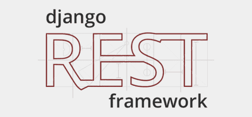

### Hi there 👋 
### I'm Ayim
>#### 🙋🏽‍♂️About Me
- 🧑‍💻 Software developer | 5years experience.
- 🚀 Exploring ML and Ai.
- 📫 You can contact me on [LinkedIn](https://www.linkedin.com/in/ayimnelson/).

>#### 👨🏽‍💻Tech Stack
- Python/Django/Django-Rest-framework
- HTML/CSS/Bootstrap
- JavaScript
- SqL
- Postgresql
- Heroku
- Railway
- AWS

>#### Backend

>#### Frontend

>#### Cloud

 

>#### Database
 
 

>#### 🚧Open to:
- Right opportunities on Web Application and website development.

>#### ✨Projects built
- [JeliScript](https://jeliscript.com), A free Computer Programming Learning Platform
- [FastFix](https://fastfix.netlify.app), A simple application template for an Electronic Shop
- [TodoAssist](https://todoassist.up.railway.app), A simple but functional to-do list app built with Django
- [BlackMagic Clone](https://blackmagicclone.netlify.app), A cloned version of Blackmagic.so

>### Note
- Most developed applications are administrative projects that I cannot showcase here.

  

>#### 🔭 I’m currently working on Edith Assist [ A Django web application focused on blogging ]

>#### ⚡ Fun fact:
- What do we call intelligence having fun!? [Creativity]

<!--
**AyimNelson/AyimNelson** is a ✨ _special_ ✨ repository because its `README.md` (this file) appears on your GitHub profile.

Here are some ideas to get you started:

- 🔭 I’m currently working on ...
- 🌱 I’m currently learning ...
- 👯 I’m looking to collaborate on ...
- 🤔 I’m looking for help with ...
- 💬 Ask me about ...
- 📫 How to reach me: ...
- 😄 Pronouns: ...
- ⚡ Fun fact: ...
-->
