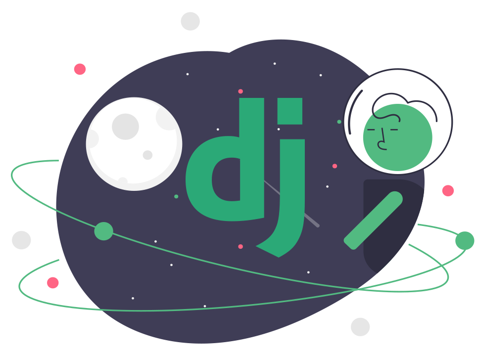

### Hi there 👋 
### I'm Ayim
>#### 🙋🏽‍♂️About Me
- Student and self-taught developer with 3years experience of web development.
- Exploring ML and Ai while focusing at school.
- You can contact me on [Twitter](https://twitter.com/ayim_nelson/).

>#### 👨🏽‍💻Tech Stack
- Python/Django
- HTML/CSS/Bootstrap
- JavaSacript
- SqLite3

>#### Backend

>#### Frontend

>#### Cloud

>#### Database
 

>#### 🚧Open to:
- Right opportunities on WebApp/website development.

>#### ✨Projects built
- My [Portfolio](https://ayimnelson-portfolio.netlify.app)
- [TodoAssit](https://todoassist.herokuapp.com), A simple but functional todolist app built with django
- [BlackMagic Clone](https://blackmagicclone.netlify.app), A cloned version of blackmagic.so

>#### ⚡ Fun fact:
- What do we call intelligence having fun!? [Creativity]

>#### 🔭 I’m currently working on Edith Assist [ A django webapp focused on blogging ]

<!--
**AyimNelson/AyimNelson** is a ✨ _special_ ✨ repository because its `README.md` (this file) appears on your GitHub profile.

Here are some ideas to get you started:

- 🔭 I’m currently working on ...
- 🌱 I’m currently learning ...
- 👯 I’m looking to collaborate on ...
- 🤔 I’m looking for help with ...
- 💬 Ask me about ...
- 📫 How to reach me: ...
- 😄 Pronouns: ...
- ⚡ Fun fact: ...
-->
